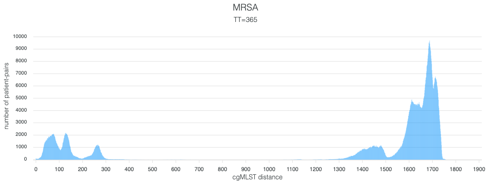
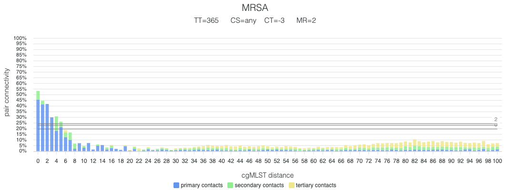

# MDRO Correlation Application

This application analyzes the relationship between **genomic sequencing** data (of bacteria) and **location data** (of patients).  
It was specifically created for correlating [cgMLST](https://en.wikipedia.org/wiki/Multilocus_sequence_typing) data of [MDRO](https://en.wikipedia.org/wiki/Multidrug-resistant_bacteria)s with patient location data at our [university hospital](https://www.ukm.de/institute/hygiene).  
Its primary objective is to assess the relationship between these datasets and derive **reproducible transmission thresholds** per bacterial species that might support clinical **practice**.

**Key Features:**

* **Local Data Processing:** Ensures strict privacy with no data uploads; all processing occurs locally.
* **Customizable Parameters:** Offers flexible spatial and temporal analysis configurations.
* **Broad Species Support:** Compatible with any cgMLST-typed bacterial species.
* **Reproducible Methodology:** Implements a method validated and used in a peer-reviewed publication.

The application is available at: [https://mdro-correlation.uni-muenster.de/2506/](https://mdro-correlation.uni-muenster.de/2506/)

## Application Modes

The application offers two distinct operational modes:

1.  **Custom Data Analysis:** Initiate the process with your own raw data, starting at [Section 1](#list-data).
2.  **Publication Data Analysis:** Utilize pre-processed, anonymized data from our publication, commencing directly at [Section 3](#matrix-filter).

The following sections detail each step of the application workflow.

 
 
 
 
 

# 1. Supplying raw data
This section covers the submission and adjustment of your self-supplied raw data.

## 1.1 Source Data Requirements
Input data must be provided in **tab-separated values (TSV) format** with the specified structures.

#### 1.1.1 Typing Data

| sequenceID | patientID | sampleDate | allele 1 | allele 2 | allele 3 | allele 4 | ... |
| ---------- | --------- | ---------- | ---------- | -------- | -------- | -------- | --- |
| sequence 1 | patient 1 | 2022-07-03 | 47 | ? | 78 | 65 | ... |
| sequence 2 | patient 2 | 2022-07-05 | 32 | 41 | 15 | 17 | ... |
| sequence 3 | patient 2 | 2022-07-05 | 32 | ? | ? | 17 | ... |
| ... | ... | ... | ... | ... | ... | ... | ... |

#### 1.1.2 Location Data

| locationID | patientID | from | till | clinic | ward | room |
| ---------- | --------- | ---- | ---- | ------ | ---- | ---- |
| location1 | patient1 | 2022-05-02 | 2022-06-14 | Dermatology | Ward B | Room 23 |
| location2 | patient1 | 2022-06-14 | 2022-07-23 | Dermatology | Ward C | Room 12 |
| ... | ... | ... | ... | ... | ... | ... |

## 1.2 Source Data Filtering Options
The following filters can be applied to the source data to improve its quality:

* **From:** Excludes all typing and location data recorded **before** the specified date.
* **Till:** Excludes all typing and location data recorded **after** the specified date.
* **Rows:** Filters out typing data rows where the percentage of correctly decoded alleles falls below a given threshold. For instance, in the example above ([Part 1.1](#part-1-1)), "sequence 3" has 50% correctly decoded alleles; a setting of "row = 51%" or higher would remove this row.
* **Columns:** Filters out typing data columns where the percentage of correctly decoded alleles falls below a given threshold. In the example above ([Part 1.1](#part-1-1)), "allele 2" has only 33% correctly decoded values; "column = 34%" would remove this column.
* **Rooms:** Removes location records lacking room-specific data.
* **Wards:** Removes location records lacking ward-specific data.
* **Open-ends:** Removes location records without a specified **till**-date.
* **Pseudonymize:** Replaces location IDs, sequence IDs, patient IDs, and clinic/ward/room names with random strings to ensure data anonymity.

 
 
 
 
 

# 2. Distance Matrix Calculation
The adjusted raw data from step 1 will be now be processed pair-wise to create distance-matrices.

## 2.1. Typing Distance Calculation

All pairs of typing data undergo comparison to determine the number of differing alleles. The results are stored in a distance matrix of size $n \times (n-1)/2$. Concurrently, a sample-date distance matrix of the same dimensions is computed for subsequent filtering (Step 5).

* **Null Values:** "Undeciphered" values can either be counted as differences or disregarded:
    * If "null" values are set to **"count,"** sequence 2 and 3 in the example (1.1) will result in a distance of 2.
    * If "null" values are set to **"not count,"** sequence 2 and 3 in the example (1.1) will result in a distance of 0.

## 2.2. Location Distance Calculation

This crucial step systematically quantifies the proximity of all patient pairs based on their recorded movements and stays within the healthcare environment. For every possible combination of two patients, the application computes their **temporal distance** (e.g., overlapping stays or consecutive occupancy) for each granularity level such as **clinic**, **ward**, and **room**, to precisely identify shared locations. Overlapping stays are stored as a positive integers, representing the number of overlapping days. Consecutive stays are stored as negative integers, representing the amount of days between stays. This yields several distinct distance matrices, each containing $n \times (n-1)/2$ entries, where 'n' is the number of patients. 

 
 
 
 
 

# 3. Distance Matrix Filtering

This section focuses on filtering the typing and location distance matrices according to parameters described in our publication.  
If you use the pre-processed publication data, the web application starts here.

## 3.1. Typing Distance Filtering

The typing distance matrix can be filtered based on the temporal distance between sample dates. This crucial filtering step ensures that only pairs of isolates collected within a epidemiologically relevant timeframe are included in subsequent analyses.

* **Typing Temporal (TT):** This parameter sets the upper limit for the number of days allowed between any two samples when considering them for correlation. For instance, setting TT to 30 days would mean that the analysis only considers pairs of MDRO isolates that were collected from patients within a month of each other. This is particularly important for identifying acute transmission events or outbreaks, as isolates with very distant collection dates are less likely to represent direct transmission within a hospital setting. A larger TT value might capture more prolonged colonization or environmental persistence, while a smaller TT value focuses on very recent acquisition events. The choice of this threshold can significantly impact the observed correlation patterns, allowing researchers to fine-tune the analysis to specific hypotheses regarding the temporality of transmission.

A histogram illustrating the distribution of typing distances is also generated after this step. This shows genetic similarity distribution over the whole range of investigated MDROs at a glance.

## 3.2. Location Distance Filtering

The location distance matrix can be filtered both spatially and temporally for precise analysis of patient interactions.

* **Contact Spatial (CS):** This parameter filters contacts by granularity: shared **clinic**, **ward**, **room**. **any** location allows for contact on any contact-level. This allows flexible assessment, from direct room-level contacts to broader clinic-wide transmission patterns. 

* **Contact Temporal (CT):** This filter considers the temporal overlap or separation of patient stays. Positive values indicate concurrent presence (direct co-location). Negative values define a temporal gap between non-overlapping stays (e.g., one patient leaving a location before another arrives), aiding in identifying potential indirect transmission.

 
 
 
 
 

# 4. Matrix Correlation 

This step performs the correlation between the cgMLST typing matrix and the contact matrix. Three parameters allow for adjustment of the correlation outcome:

* **Typing Distance (TD):** This parameter sets the upper limit for genetic distance in correlation analysis, directly influencing the "width" of the resulting chart that visualizes genetic similarity and contact patterns. A higher TD allows for investigating broader transmission dynamics, incorporating more genetically divergent isolates. Increasing this limit processes a wider range of genetic comparisons, leading to increased computation time. 

* **Contact Depth (CD):** This parameter is instrumental in defining the complexity of the transmission pathways that the application considers. It specifies the maximum number of allowed intermediary contacts between patients. For instance, a 'Contact Depth' of 0 focuses exclusively on direct patient-to-patient contacts, meaning only patients who shared a common location at the same time are considered linked. A 'Contact Depth' of 1 allows for one intermediary contact (e.g., Patient A was in contact with Patient X, who was then in contact with Patient B), enabling the identification of second-degree connections. Increasing this depth further, to 2 or 3, allows the analysis to uncover more complex, indirect transmission chains that might not be immediately apparent through direct contact tracing. While invaluable for unraveling intricate epidemiological links, it is important to understand that calculating these second, third, or even higher-degree connections involves a combinatorially larger number of potential pathways to evaluate, which will significantly increase computation time and resource consumption.

* **Mutation Rate (MR):** This parameter is exclusively used for indirect contacts! It sets the maximum allowed deviation from the currently calculated typing distance for intermediary contacts, providing crucial flexibility when assessing potential indirect transmission routes. For example, if Patients A & B have a Typing Distance = 3 and a Mutation Rate = 2, a Patient Link "A-X-B" allows "A-X" and "X-B" distances of up to 5 (i.e., the sum of the direct distance and the mutation rate). 

Results can be downloaded as raw data or visualized in a chart, as shown in the example below:

 
 
 
 
 

# 5. Appendix

## Overview of All Available Parameters

| Parameter | Full Name          | Description                                                    | Default             |
| :-------- | :----------------- | :--------------------------------------------------------------- | :------------------ |
| **TT** | Typing Temporal    | Maximum allowed days between samples                             | 365 days            |
| **CS** | Contact Spatial    | Spatial granularity level (room, ward, clinic)                 | room, ward, clinic  |
| **CT** | Contact Temporal   | Temporal gap between stays                                       | -3 days             |
| **CD** | Contact Depth      | Number of allowed intermediary contacts                          | 0 (direct only)     |
| **MR** | Mutation Rate      | Allowed deviation for intermediary contacts (applies to indirect contacts only) | 2 |

    

## Legal Notice

### Responsible Entity:
Institut für Hygiene
Robert-Koch-Straße 41
48149 Münster
[www.ukm.de/institute/hygiene](https://www.ukm.de/institute/hygiene)

### Head of the Institute:
Univ.-Prof. Dr. med. Alexander Mellmann
alexander.mellmann@ukmuenster.de

### Application Development:
Dr. med. univ. Maximilian Fechner
max.fechner@uni-muenster.de

### Raw Data Extraction:
Dr. med. Hauke Tönnies
hauke.toennies@ukmuenster.de